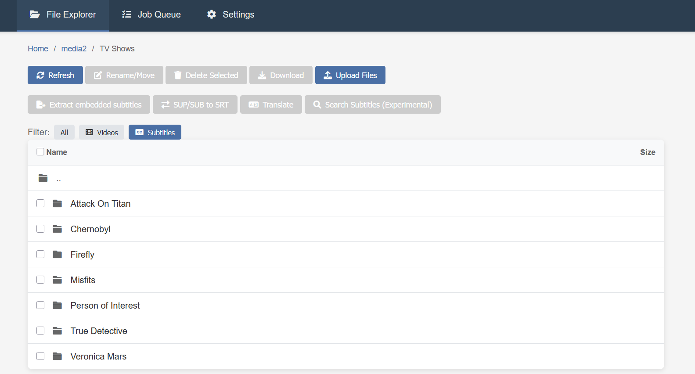

## Overview

A comprehensive web-based subtitle processing application with support for OCR conversion, translation, subtitle search, and file management. The application runs in Docker and provides a modern web interface for managing subtitle workflows.



## Motivation

I was looking for a tool that could easily translate subtitles in my media files into a target language, but Bazarr didn’t work well for my needs and had some frustrating limitations. Subtitle Edit is a solid tool, but I wanted a web-based interface that I could run on a server. So I decided to build my own solution with the help of AI.

## Prerequisites

You need at least one API key for a translation provider (DeepL or Azure). For that you need to sign up for an account on the respective provider and identify yourself via a credit card.

Easy access to video files with embedded subtitles.

A non-public media server with:
- Docker
- Docker Compose
- Git
- Single mount point for media files

## Installation

1. Clone the repository on your server:
```
git clone git@github.com:momith/subtitle-cockpit.git
```
2. Configure at least the following variables in the .env file:
```
MEDIA_DIR=/media/
TESSDATA_LANGS=eng deu
```
3. Build and run the container:
```
docker compose up -d --build
```
4. Access the application at http://your-server-ip:5000

## Configuration

The application can be configured via the web interface at `/settings`. Configure at least the following settings:
- Extraction source language
- OCR source language
- Translation target language
- At least one translation provider (DeepL or Azure)

## Usage

The application is intended to run on the same server as a Plex/Emby/other media player. The intended workflow is as follows:
1. Get a high-quality video file (i.e. bluray quality), because usually they have the subtitles embedded. This step is not covered by the application.
2. (Button click) Upload the video file to the application
3. (Button click) Extract the hardcoded image-based subtitles from the video file 
4. (Button click) Convert the image-based subtitles to textual SRT format
5. (Button click) Translate the subtitles to the target language
6. Refresh the media player library to see the new subtitles

## Naming conventions (important)

Subtitle Cockpit relies heavily on file naming to infer metadata (especially for subtitle search and publishing). You will get the best results when your filenames contain as much structured information as possible.

- **Video files**
  - Include the **movie/series name**.
  - Include the **audio language** (if you have multiple audio tracks/variants).
  - For series, include **season and episode** (e.g. `S01E01`).
  - If you plan to use the **Publish** feature: the more information you include about the RIP/release, the better (e.g. `720p`, `1080p`, `bluray`, `web`, release group name).

  Example:
  - `attack.on.titan.s01e01.720p.bluray.x264.mkv`

- **Subtitle files (.srt)**
  - Make sure each subtitle filename ends with a **language code**, followed by the extension.
  - Format: `...<anything>.<lang>.srt`

  Examples:
  - `attack.on.titan.s01e01.720p.bluray.x264.en.srt`
  - `attack.on.titan.s01e01.720p.bluray.x264.th.srt`
